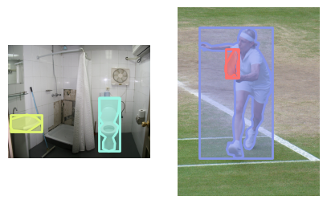

# COCO Format
* Note: images and annotations in this tutorial are modified from COCO dataset. *

### Resources
 - [COCO format](https://cocodataset.org/#format-data)
 - [Official Python tools](https://github.com/cocodataset/cocoapi/tree/master/PythonAPI/pycocotools)

### Homework
 1. update your forked repo from my repo([ref](https://docs.github.com/en/pull-requests/collaborating-with-pull-requests/working-with-forks/syncing-a-fork))
 1. following [01_git](../01_git/), create a new branch `LAST#_07coco` (ex: pan667_07coco) in your forked repo
 1. activate the environment you created in [03_conda](../03_conda/)
 1. read and understand what COCO format is
 1. download `2017 Train/Val annotations` [here](https://cocodataset.org/#download) and use python to load `instances_val2017.json` (hint: use `json` package)
 1. explore the data, for example checking keys and data types, to see if you thoroughly understand the format (hint: you can cross-validate with the doc [COCO format](https://cocodataset.org/#format-data))
 1. use Python to load `annotations.txt` and write a `LAST#.py` to convert it to COCO format `LAST#.json` (hint: use syntax `with open` to load txt and readlines, use `json` package to save the result file)
  - don't need to care about `info`
  - for images, ignore `license`, `flickr_url`, `coco_url`, and `date_captured`
  - for annotations, use RLE format for segmentation (hint: use (official tools)[https://github.com/cocodataset/cocoapi/blob/master/PythonAPI/pycocotools/mask.py] which should be already installed with detectron2), find `area` and `bbox` yourself, and simply set `iscrowd` to 0
  - for categories, simply copy from `instances_val2017.json`
1. run `python demo.py -f pan667.json -r ~/PerceptionTutorials/07_COCO/` (repalce with your path) to plot a demo, you should see a `demo.jpg` looking like the following: 
1. run `black` with line length 100, `isort`, and `flake8` on `LAST#.py`
1. move `LAST#.py` and `LAST#.json` to `submissions`
1. stage changes (DO NOT ADD `demo.jpg`), commit with the message "learning coco", push and submit a pr
