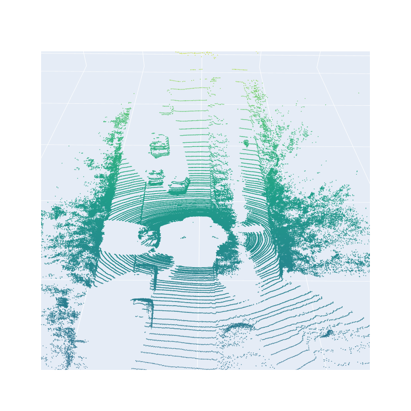
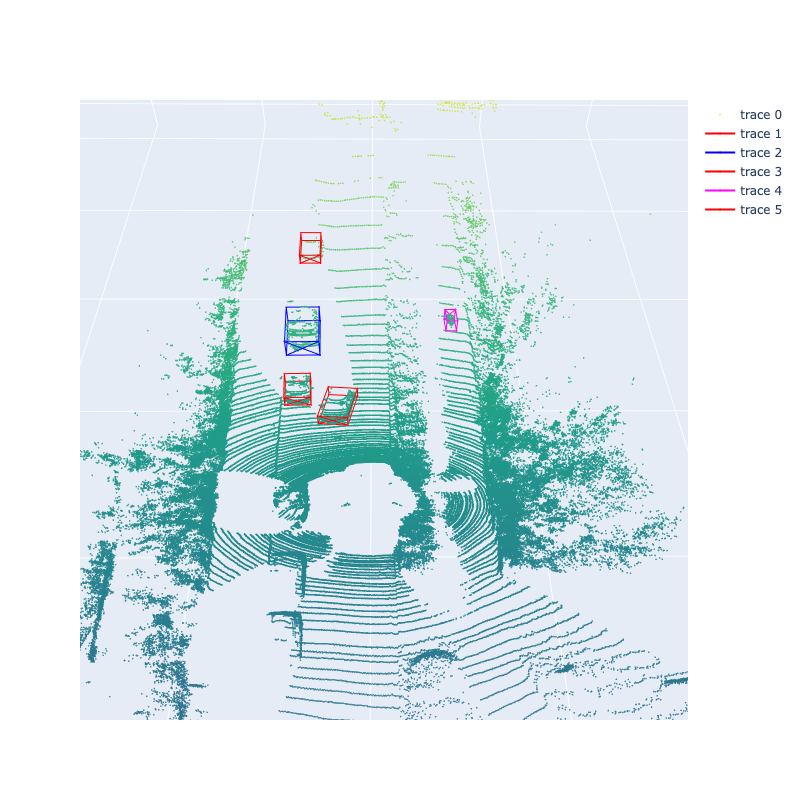

# 3D Point Cloud

### Resources
 - [kitti](https://www.cvlibs.net/datasets/kitti/eval_object.php?obj_benchmark=3d)
 - [tutorial](https://github.com/dtczhl/dtc-KITTI-For-Beginners/tree/ca140be438371cee224057fd9e9632d3c9b46b14)
 - [tutorial](https://towardsdatascience.com/kitti-coordinate-transformations-125094cd42fb)
 - [calibration](https://github.com/charlesq34/frustum-pointnets/blob/master/kitti/kitti_util.py)

### Homework
 1. update your forked repo from my repo([ref](https://docs.github.com/en/pull-requests/collaborating-with-pull-requests/working-with-forks/syncing-a-fork))
 1. following [01_git](../01_git/), create a new branch `LAST#_10pc` (ex: pan667_10pc) in your forked repo
 1. read and understand what KITTI Point Cloud format is
 1. download `kitti raw data development kit` [here](https://www.cvlibs.net/datasets/kitti/raw_data.php) and `kitti object development kit ` [here](https://www.cvlibs.net/datasets/kitti/eval_object.php?obj_benchmark=3d), read `readme.txt` in both kits and tutorials to understand 
   - how kitti organize its dataset
   - coordinate systems of different sensors (each sensor, like camera1, camera2, or lidar, has its origion and coordinate system)
   - how to transform from one coordinate system to another (e.g. lidar to camera) by calibration matrix (e.g. `calib.txt`)
   - annotation file (what each column means, for example in `label.txt`)
 1. activate the environment you created in [03_conda](../03_conda/)
 1. install `Plotly` with Jupyter-lab support
 1. create a notebook under `submissions` and name as `LAST#.ipynb`
 1. start jupyterlab, it should open a window in your browser. open your LAST#.ipynb
 1. write your code to visualize point cloud in Velodyne coordinate; use graph_objects Scatter3d package of Plotly
   - aspect ratio [x, y, z] = [1, 1, 0.1]
 1. project point cloud in Velodyne coordinate to Camera coordinate (hint: refer to `calibration` [here](https://github.com/charlesq34/frustum-pointnets/blob/master/kitti/kitti_util.py)) and visualize in Camera coordinate (aspect ratio [x, y, z] = [1, 0.1, 1]); set point color changing with distance (different color from closer to further). you should get results looking like the following:
   

 1. rotate the bounding box using yaw-angle, refer to [here](https://github.com/dtczhl/dtc-KITTI-For-Beginners/tree/ca140be438371cee224057fd9e9632d3c9b46b14), draw 3d bounding boxes on the point cloud in the Camera coordinate, you should get results looking like the following:
   

