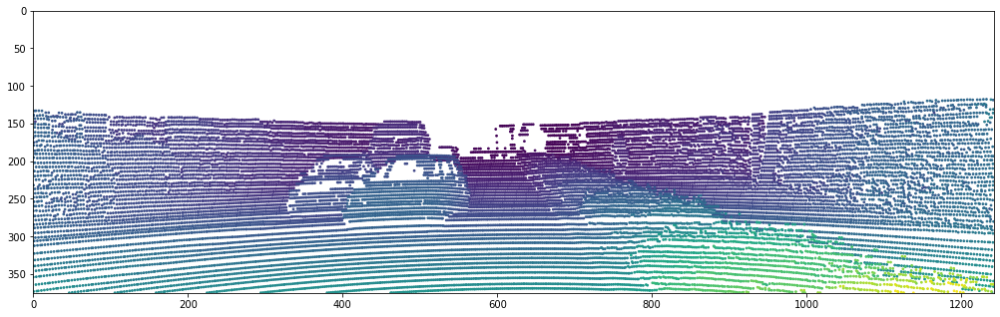
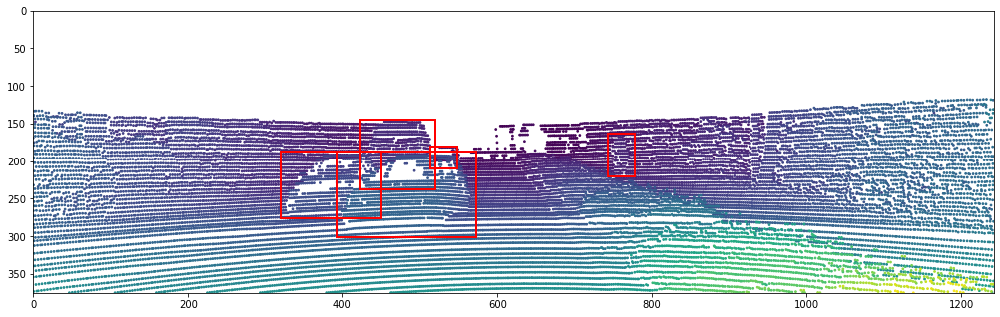
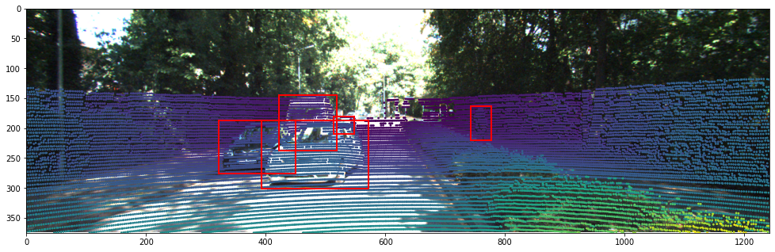

# Projection from 3D to 2D
*Note: Data used here are modified from KITTI dataset.*

### Resources
[10_3d_pointcloud](../10_3d_pointcloud/)
[08_2d_visualization](../08_2d_visualization/)

### Homework
 1. update your forked repo from my repo([ref](https://docs.github.com/en/pull-requests/collaborating-with-pull-requests/working-with-forks/syncing-a-fork))
 1. following [01_git](../01_git/), create a new branch `LAST#_11projection` in your forked repo
 1. activate the environment you created in [03_conda](../03_conda/)
 1. create a notebook under `submissions` and name as `LAST#.ipynb`
 1. start `jupyterlab`, it should open a window in your browser. open your `LAST#.ipynb`
 1. following [10_3d_pointcloud](../10_3d_pointcloud/), read image `image.png`, read calibration matrices from `calib.txt` and point cloud from `velo.bin`; do the preprocessing
 1. plot projected point cloud
    - Last tutorial we said X2 = R0_rect @ Tr_velo_to_cam @ X1 to transfer point clouds from Velodyne coordinate to rectified camera coordinate. Here we just need further P2 to project from rectified camera coordinate to camera 2 coordinate, X3 = P2 @ R0_rect @ Tr_velo_to_cam @ X1.
    - prepare all metrics into homogeneous and perform the above calculation (remember to transpose); drop the last column in X3
    - divide x (first column) and y (second column) in X3 by z(third column)([why](https://en.wikipedia.org/wiki/3D_projection))
    - get the index of points that are inside the image view (i.e., x within [0, width) and y within [0, height)) and farther away than 2 meters (z > 2, filter out points that are too close to the sensor)
    - use the following code to create a figure:
    ```python
        px = 1 / plt.rcParams['figure.dpi']  # pixel in inches
        h, w = im.height, im.width
        fig, ax = plt.subplots(1, 1, figsize=(w*px, h*px))
        ax.set_xlim([0, w])
        ax.set_ylim([h, 0])
    ```
    - plot the scatter on the figure (`ax.scatter()`); set marker size to 3 and colors to 1/z (you can use z as well. 1/z is just further scaling the distance to make colors more differentiated in the figure. you can plot both and compare.); you should see the following:
    
    - read `label.txt`, parse each line, skip "DontCare" class, get 2D bounding box, and plot it (similar to what we did in [08_2d_visulization](../08_2d_visulization/)); you should see the following:
    
    - plot image as well (`ax.imshow()`); you should see the following:
    
 1. stage changes, commit with the message "learning KITTI", push and submit a pr
